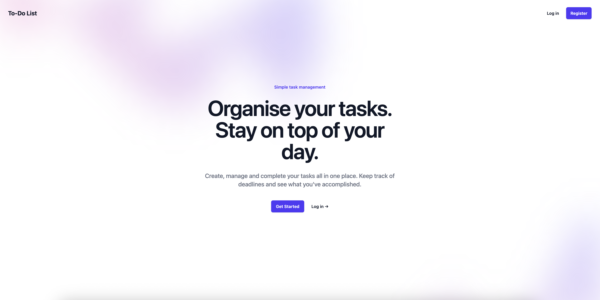

<div align="center">
<a href="https://github.com/Sumonta056/FixHub-Issue-Tracker-Website" target="blank">

</a>

<h2> Project Name : To-Do-List Laravel </h2>




</div>


## 💡 Overview

To-Do List is a simple and intuitive task management application built with Laravel, designed to help users organise and manage their everyday tasks.

The application provides secure user authentication and allows each user to maintain their own personal task list. Users can create, view, update and delete tasks, track their completion status and record when tasks have been completed.

The project focuses on clean Laravel development practices, reusable UI components, user-specific data and a responsive interface.

## ✨ Features

- **🔐 User Authentication:** Secure registration and login functionality, with each user having access to their own personal tasks.

- **📝 Task Management:** Create, view, update and delete tasks using a complete CRUD workflow.

- **👤 User-Specific Tasks:** Tasks are associated with individual users, ensuring users only see their own task list.

- **✅ Task Status Tracking:** Tasks can be tracked as completed or pending, with completion dates recorded when appropriate.

- **📄 Pagination:** Tasks are displayed using pagination to keep the task list organised and easy to navigate.

- **🔔 Flash Notifications:** Success messages provide feedback when tasks are created, updated or deleted.

- **🗑️ Delete Confirmation:** Confirmation modals help prevent tasks from being accidentally deleted.

- **🧩 Component-Based UI:** Reusable Termon UI Blade components are used throughout the application to provide a clean and consistent interface.

- **🧪 Feature Testing:** PHPUnit feature tests cover task creation, updating, deletion and user-specific task visibility.

- **📱 Responsive Design:** The interface uses Tailwind CSS and responsive layout components to adapt across different screen sizes.

## 🙏 Credits

### Termon UI

The user interface makes use of **Termon UI**, which provides reusable Laravel Blade components for elements such as cards, forms, buttons, badges, chips, modals, pagination and other interface components.

Termon UI helped reduce repeated markup and keep the Blade views clean, consistent and component-based.

[View the Termon UI GitHub Repository](https://github.com/termon/ui)

## 👩‍💻 Tech Stack

- **Laravel 13**: PHP web application framework used to build the application's backend, routing, authentication and task management functionality.
- **PHP 8.4**: Server-side programming language used throughout the Laravel application.
- **Blade**: Laravel's templating engine used to build the application's views.
- **Tailwind CSS**: Utility-first CSS framework used for styling and responsive layouts.
- **Termon UI**: Blade component library used for reusable interface elements including forms, cards, buttons, modals, chips and pagination.
- **Flux**: UI component library used as part of the Laravel starter kit and application layout.
- **Livewire**: Included within the Laravel application stack and starter kit.
- **SQLite**: Relational database used to store users and their tasks during local development.
- **PHPUnit**: Testing framework used for feature testing, including task creation, updating, deletion and user-specific task access.

## 📦 Getting Started

To get a local copy of this project up and running, follow these steps.

### 🚀 Prerequisites

Make sure you have the following installed:

- **PHP 8.3 or higher**
- **Composer**
- **Node.js**
- **npm**
- **SQLite**

## 🛠️ Installation

1. **Clone the repository:**

   ```bash
   git clone https://github.com/nate2293/to-do-list.git
   cd to-do-list
   ```

2. **Install PHP dependencies:**

   ```bash
   composer install
   ```

3. **Install frontend dependencies:**

   ```bash
   npm install
   ```

4. **Create the environment file:**

   ```bash
   cp .env.example .env
   ```

5. **Generate the application key:**

   ```bash
   php artisan key:generate
   ```

6. **Create the SQLite database:**

   ```bash
   touch database/database.sqlite
   ```

7. **Run the database migrations:**

   ```bash
   php artisan migrate
   ```

8. **Start the development environment:**

   ```bash
   composer run dev
   ```

## 📖 Usage

### ✔ Running the App

Start the Laravel development environment with:

```bash
composer run dev
```

Then open the local URL shown in your terminal, normally:

```text
http://localhost:8000
```

From there, create an account or log in to begin creating and managing tasks.

### 🧪 Running Tests

Run the application's PHPUnit tests with:

```bash
php artisan test
```

## 🤝 Contributing

Contributions and suggestions are welcome.

1. Fork the repository.
2. Create a new branch.
3. Make and commit your changes.
4. Push your branch.
5. Open a pull request.

## 🐛 Issues

If you encounter any problems, feel free to open an issue in the [GitHub Issues](https://github.com/nate2293/to-do-list/issues) section with a brief description of the problem and any relevant screenshots or error messages.